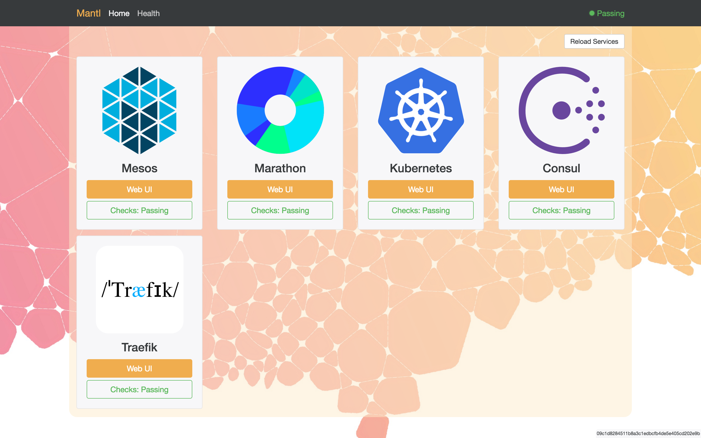

# nginx-mantlui

Docker image derived from [nginx-consul](nginx-consul) that includes a simple user interface to [Mantl](http://mantl.io/) components.



## Setup

This image is integrated tightly with Mantl clusters and is not likely to be useful outside of one (except, perhaps, as an example of using nginx-consul). In Mantl, it is configured to run on all control nodes and, based on Consul service discovery, consolidates various control UIs and APIs into a single place.

## User Interfaces

### Mesos UI (/mesos)

The 0.26 Mesos UI is included in the nginx-mantlui container. The following source files have been modified:

* html/mesos/browse.html
* html/mesos/index.html
* html/mesos/js/app.js
* html/mesos/js/controllers.js
* html/mesos/js/services.js
* html/mesos/pailer.html

The changes are minor &mdash they are just small changes to URLs so that the UI works properly through the proxy.

The proxy ensures that you are always connected to the UI on the leading Mesos master. This functionality depends on [mesos-consul](https://github.com/CiscoCloud/mesos-consul). Also, every Mesos agent is proxied so that the agent APIs are reachable.

### Marathon UI and API (/marathon)

The nginx configuration just proxies requests to the underlying Marathon UI and API.

### Consul UI (/consul)

The 0.5.2 Consul UI is included in the nginx-mantlui container. The only update is to the `html/consul/application.min.js` file and it is to adjust the path to properly communicate to the Consul API through the proxy. The update was made in [this commit](https://github.com/CiscoCloud/nginx-mantlui/commit/5ab35f3819fb81a1bbb9120d258e1b42dfbbd207) with the following command:

```shell
find . -type f -exec sed -i '' 's/\/v1/\/consul\/v1/g' {} +
```

### Chronos UI (/chronos)

The nginx configuration just proxies requests to the underlying Marathon UI and API.

### Mantl API (/api)

The nginx configuration just proxies requests to [mantl-api](https://github.com/CiscoCloud/mantl-api) running in the cluster.

### Traefik (/traefik)

The Traefik UI is embedded in the Traefik binary running on edge nodes. We need to override a few files to change the API urls that the Traefik UI depends on. These files are:

* html/traefik/dashboard/index.html
* html/traefik/dashboard/scripts/app-*.js
* html/traefik/dashboard/scripts/vendor-*.js

Because Traefik script file names include a content hash, we must rebuild them with our changes. It is important that the script files match the version of Traefik that is running in Mantl.

#### Building Traefik Assets

1. Clone the Traefik repository

    ```shell
    git clone git@github.com:emilevauge/traefik.git
    cd traefik
    ```

2. Checkout the tag of the correct Traefik release. For example:

    ```shell
    git checkout -b r475 v1.0.0-beta.475
    ```

3. Update the webui API paths.

    At the time of this writing, the changes look like this:

    ```diff
    diff --git a/webui/src/app/core/health.resource.js b/webui/src/app/core/health.resource.js
    index a765462..f50b001 100644
    --- a/webui/src/app/core/health.resource.js
    +++ b/webui/src/app/core/health.resource.js
    @@ -7,7 +7,7 @@

    /** @ngInject */
    function Health($resource) {
    -        return $resource('/health');
    +        return $resource('/traefik/health');
    }

    })();
    diff --git a/webui/src/app/core/providers.resource.js b/webui/src/app/core/providers.resource.js
    index c363fd2..dcf4a60 100644
    --- a/webui/src/app/core/providers.resource.js
    +++ b/webui/src/app/core/providers.resource.js
    @@ -7,7 +7,7 @@

    /** @ngInject */
    function Providers($resource) {
    -      return $resource('/api/providers');
    +      return $resource('/traefik/api/providers');
    }

    })();

    ```

4. Generate Docker image

    ```shell
    make build
    ```

5. Generate the Web UI

    ```shell
    make generate-webui
    ```

6. Copy the script files from `./static` to the nginx-mantlui project. For example:

    ```shell
    cp static/index.html ../nginx-mantlui/html/traefik/dashboard/
    cp static/scripts/app-34497b2210.js ../nginx-mantlui/html/traefik/dashboard/scripts
    cp static/scripts/vendor-b67094242f.js ../nginx-mantlui/html/traefik/dashboard/scripts
    ```

    You will have to adjust the file names to use the content hash that is appropriate for the release you are building.

7. Delete any old script files from traefik scripts directory (if applicable):

    ```shell
    git rm html/traefik/dashboard/scripts/app-a08ab8d76c.js
    git rm html/traefik/dashboard/scripts/vendor-3ce5552a6a.js
    ```
